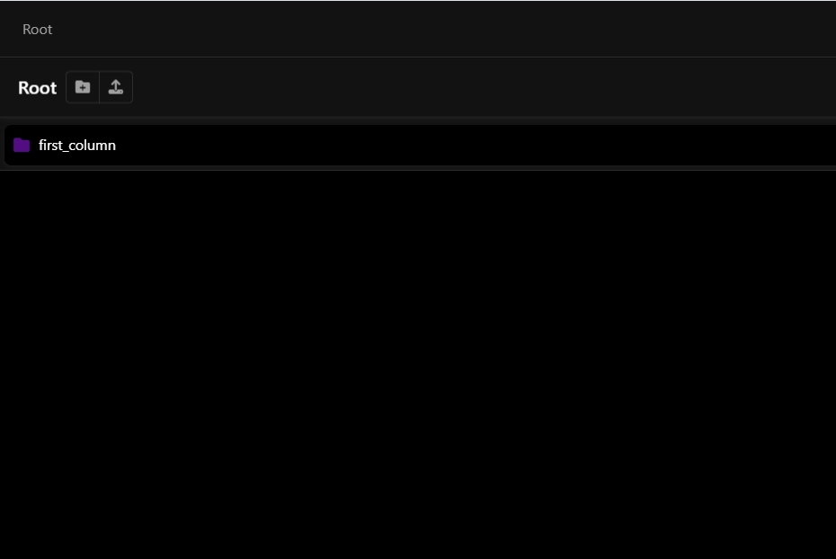
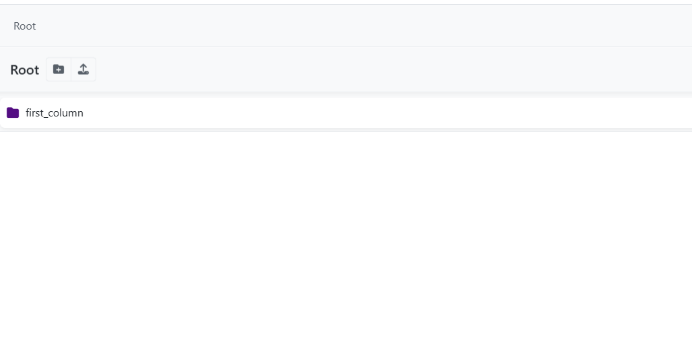
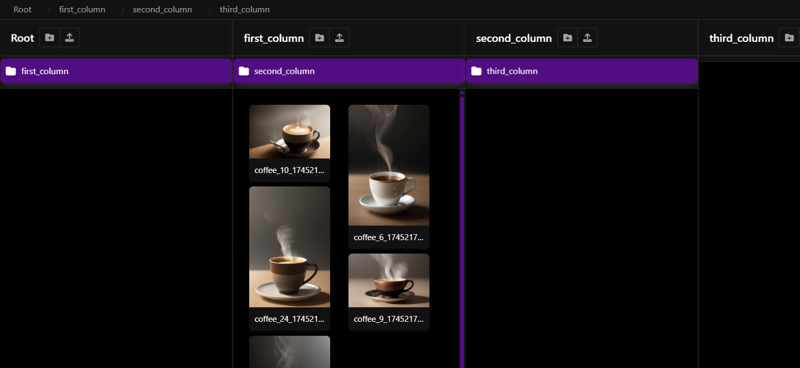
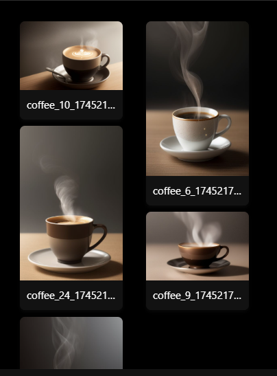
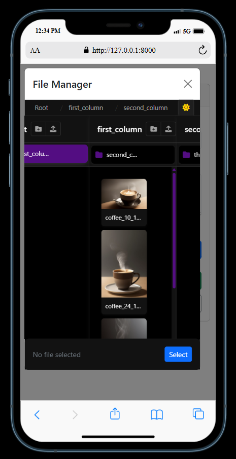
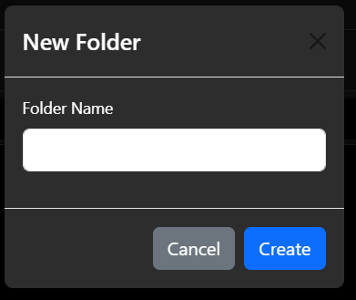
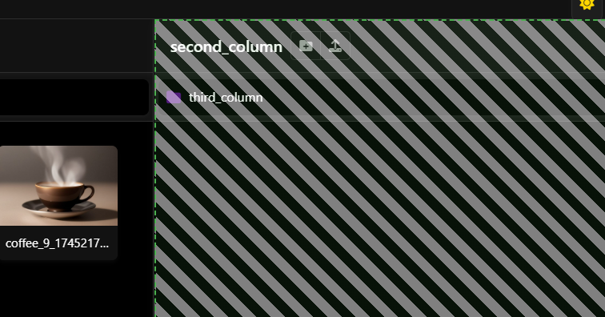
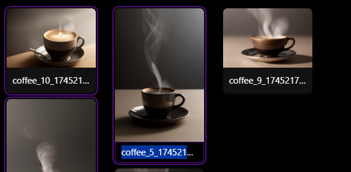
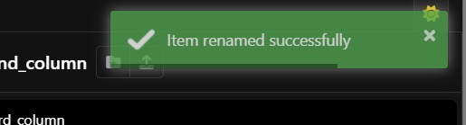

<p align="center"><a href="https://laravel.com" target="_blank"></a></p>

<p align="center">
<a href="https://github.com/laravel/framework/actions"></a>
<a href="https://packagist.org/packages/laravel/framework"></a>
<a href="https://packagist.org/packages/laravel/framework"></a>
<a href="https://packagist.org/packages/laravel/framework"></a>
</p>

# FMS (File Management System)

A modern, responsive file management system built with Laravel and JavaScript. This file manager provides an intuitive interface for managing files and folders with a multi-column browsing experience, similar to Finder on macOS or Explorer on Windows.

## Features

### User Interface
- **Multi-Column Browsing**: Navigate through your folders with a dynamic column-based interface
- **Drag and Drop Support**: Easily move files between folders with visual feedback
- **File Preview**: Automatic preview of image files
- **Responsive Design**: Works on desktop and mobile devices
- **Selection System**: Select and act on multiple files at once

### File Operations
- **Upload Files**: Upload files to any folder by drag-and-drop or file selection
- **Create Folders**: Create new folders in the current directory
- **Rename Files/Folders**: Rename files by clicking on their names, folders via rename button
- **Delete Files/Folders**: Delete individual or multiple files/folders with confirmation
- **Move Files/Folders**: Move files and folders to different locations
- **Download Files**: Download individual files or entire folders as ZIP archives

### Security Features
- **User Authentication**: Files are stored in user-specific directories
- **File Validation**: Secure file uploads with validation and sanitization
- **Unique Filenames**: Files are saved with unique names to prevent overwriting
- **Path Traversal Protection**: Protection against directory traversal attacks

## Technical Implementation

### Frontend
- JavaScript-based interface with jQuery
- Bootstrap 5 for responsive UI components
- SweetAlert2 for beautiful notification dialogs
- FontAwesome icons
- Customized CSS for visual feedback and animations

### Backend
- Laravel 12 framework
- PHP 8.1+ compatibility
- User-specific storage using Laravel's filesystem
- AJAX-based operations for smooth user experience

    --------------------------------------------------------------
    Table of Contents
    --------------------------------------------------------------
    1. Key Features
    2. File Operations
    3. Interface Capabilities
    4. Installation
    5. Usage Guide
    6. Security
    7. Customization
    8. License

--------------------------------------------------------------
Key Features ✨
--------------------------------------------------------------

Core Functionality:
- 🌓 Dark/Light Mode - Switchable color schemes for user preference  
   | 

- 🗂️ Column Navigation - Windows Explorer-style multi-column browsing  
  

- 🖼️ Masonry Grid - Dynamic image previews with masonry layout  
  

- 📱 Responsive Design - Fully functional on all devices  
  

--------------------------------------------------------------
File Operations 📁
--------------------------------------------------------------

| Feature              | Description                                           | Preview (Dark Mode)                            |
|----------------------|-------------------------------------------------------|------------------------------------------------|
| Folder Management    | Create/rename/delete folders with context menus       |          |
| Drag-n-Drop Upload   | Upload single/multiple files via drag-and-drop        |            |
| Inline Renaming      | Click-to-edit filenames with instant updates          |          |
| Visual Feedback      | Color-coded status indicators for all operations      |  |


## Installation

### Clone this repository

1. **Copy Module Files**  
   Copy and Place the `filemanager-module` directory in your project root.
   
   Your project should now have the folder structure like this in root directory

   ```bash
    your-project/
    │
    ├── app/
    ├── bootstrap/
    ├── config/
    ├── database/
    │
    ├── filemanager-module/          <-- 🔌 Your Portable File Manager Module
    │   ├── Controller/
    │   │   └── FileManagerController.php
    │   │
    │   ├── views/
    │   │   └── index.blade.php
    │   │
    │   ├── public/
    │   │   └── filemanager/
    │   │       ├── css/
    │   │       │   ├── file-manager.css
    │   │       │   └── min.frontend.css
    │   │       └── js/
    │   │           └── file-manager.js
    │   │           └── min.frontend.js
    │   │
    │   ├── routes/
    │   │   └── filemanager.php
    │   │
    │   └── README.md
    │
    ├── public/
    ├── resources/
    ├── routes/
    ├── storage/
    ├── tests/
    │
    ├── .env
    ├── artisan
    ├── composer.json
    └── package.json


   ```

2. **Update Autoload Configuration**  
   Add the following to your `composer.json` under the `autoload.psr-4` section:
   ```json
   "FileManagerModule\\": "filemanager-module/"
    ```

3. **Register Routes**

    Add the following to your routes/web.php:
    ```php
    require __DIR__ . '/../filemanager-module/routes/filemanager.php';
    ```

4. **Then Run**  
    ```bash
    composer dump-autoload
    ```

Then continue with you regular laravel setup

## Usage

1. Navigate to `/file-manager` in your browser
2. The interface shows files and folders in the root directory
3. Click on folders to navigate into them
4. Use the action buttons to upload, create folders, delete, or download
5. Drag and drop files to upload or move between folders

## 🔧 Customization

Below is a list of files you can override or modify to tailor the file manager module to your application's needs:

| Type              | File Path                                     | Description                                                                 |
|-------------------|-----------------------------------------------|-----------------------------------------------------------------------------|
| **View**          | `views/filemanager.blade.php`                 | Main Blade template for the UI layout. Customize structure and components. |
| **CSS (Editable)**| `public/filemanager/css/file-manager.css`     | Core styles for the file manager interface.                                |
| **CSS (Minified)**| `public/filemanager/css/min.frontend.css`     | Minified version of frontend styles. Rebuild if using custom CSS pipeline. |
| **JS (Minified)** | `public/filemanager/js/min.frontend.js`       | Core logic for navigation, uploads, drag-and-drop, etc. Extendable.        |
| **JS (Editable)** | `public/filemanager/js/file-manager.js`       | Core logic for navigation, uploads, drag-and-drop, etc. Extendable.        |
| **Controller**    | `Controller/FileManagerController.php`        | Laravel controller for backend operations like upload, delete, move.       |
| **Routes**        | `routes/filemanager.php`                      | Route file for registering file manager endpoints.                         |
| **Storage**       | `storage/` (linked via `php artisan storage:link`) | Location where uploaded files are saved. Can be changed via filesystem config. |

> 💡 **Tip:** All files are part of a self-contained module. You can plug this into any Laravel app and start customizing instantly without affecting your main application.

